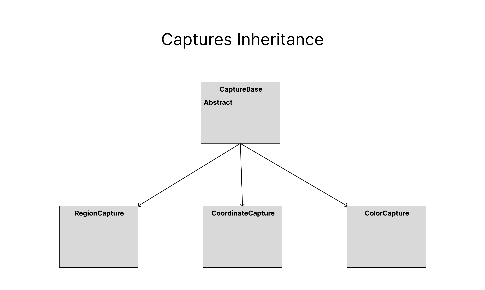
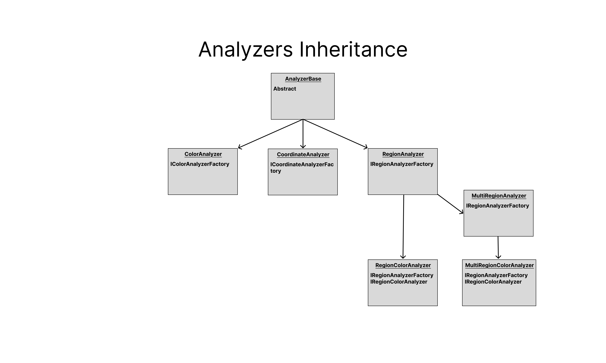

# ScreenLab

**ScreenLab** is a C#/.NET 8 library designed to **capture and analyze specific areas of the screen**, focusing on regions (rectangles), colors, and coordinates. It provides a framework for screen-based automation, analysis, and pattern recognition.

---

## 🧩 Features

- **Region Capture & Analysis** – Define and monitor screen areas.
- **Color Capture & Search** – Find specific colors on the screen and track them.
- **Coordinate Capture** – Save and work with static or dynamic screen positions.
- **Overlay Tools** – Visual selection of regions, coordinates, and color points using WinForms.

All core logic is built with extensibility in mind, with major functionality located in the `Screen/` directory.

---

## 📌 Use Cases

ScreenLab is intended for developers building:

- UI automation tools
- Visual screen analyzers
- Game overlay utilities
- Custom screen trackers and bots

---

## 💻 Technologies

- **Language**: C#
- **Framework**: .NET 8
- **UI**: WinForms (used for overlays and visual selection)

---

## 📦 Installation & Usage

1. **Build the project** using Visual Studio or the .NET CLI.
2. **Reference the compiled DLL** in your own project.
3. Start using ScreenLab’s capture and analyzer components programmatically.

---

## 📊 Diagrams

The following diagrams outline the relationships with the Capture and Analyzer classes:

### Captures

### Analyzers

---

## 🚧 Roadmap / Future Plans

- Expand built-in **analyzers** for more complex automation scenarios.
- Decouple overlays from **WinForms**, potentially moving to a cross-platform UI layer.
- Add unit tests and plugin support.

---

## ⚠️ License

This project currently has **no license**, which means it is **not open source** under a formal license. Use at your own discretion. A license may be added in the future.

---

## 🤝 Contributions

Contributions are welcome via pull requests or suggestions via issues. Feel free to fork and experiment!

